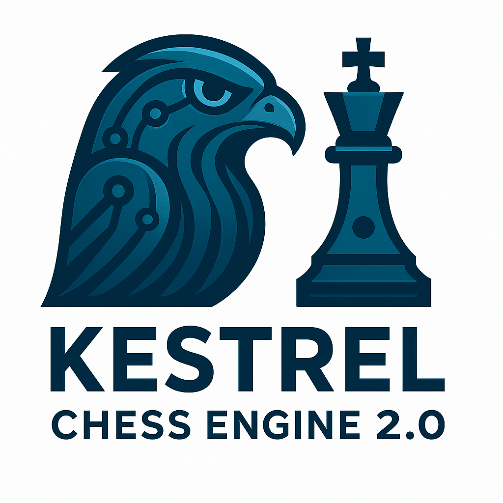

<div align="center">
    
</div>

# Kestrel 🦅

> A lightweight Python chess engine applying modern AI search principles to an ancient game.

---

## 📖 About The Project

Kestrel is a passion project born from an interest in building lightweight, custom search engines. I wanted to apply those principles to one of the most fascinating search problems: the game of chess.

---

## 🚀 Getting Started

Follow these instructions to get a copy of Kestrel running on your local machine.

Make sure you have the following installed on your system:
*   **Python 3.8+**
*   **Git**

### Installation & Setup

1.  **Clone the Repository**

    Open your terminal and clone the repository to your local machine.

    ```
    git clone https://github.com/SatchitK/Kestrel.git
    ```

2.  **Navigate to the Project Directory**

    Move into the newly created folder:
    ```
    cd Kestrel
    ```

3.  **Install Dependencies**

    Install all the required Python packages using the `requirements.txt` file.
    ```
    pip install -r requirements.txt
    ```

### Running the GUI

With the setup complete, you can launch the Kestrel graphical user interface.

Run the main Python script from the root of the project directory:
```
python -m gui.gui
```
