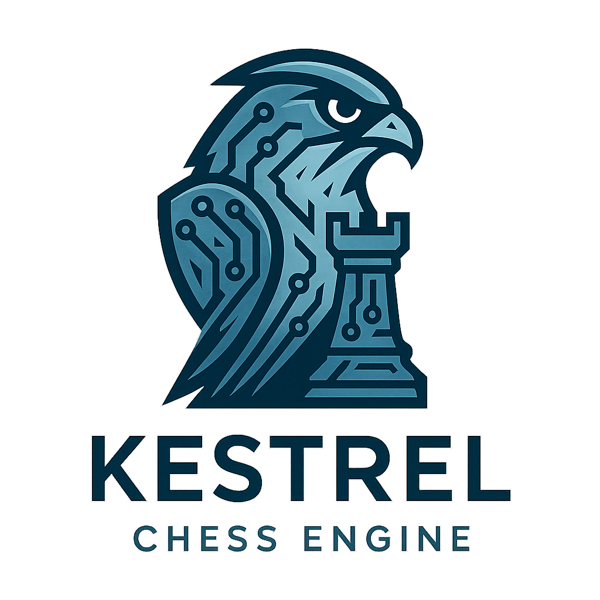

  

# Kestrel 🦅

> A lightweight Python chess engine applying modern AI search principles to an ancient game.

---

## About The Project

Kestrel is a passion project born from an interest in building lightweight, custom search engines. I wanted to apply those principles to one of the most fascinating search problems: the game of chess.
